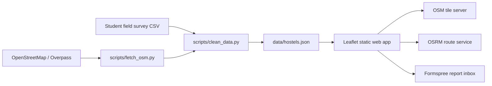

# Architecture and security notes

The browser does not geocode and does not call Overpass at page load. Coordinates are persisted in `data/hostels.json`. Road routes are requested from OSRM and cached in browser storage for faster repeat visits. User correction reports are submitted through Formspree using the endpoint in `data/site_config.json`.

A future custom backend should use HTTPS, prepared statements, input validation, report rate limiting, moderation and hashed admin credentials.
