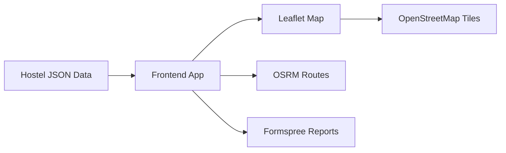

# Nookly Presentation Slides

## Slide 1: Title

**Nookly: OAU Student Housing Finder**  
SWEP 200 Group Project  
Student housing discovery around Obafemi Awolowo University, Ile-Ife

## Slide 2: Problem

- Students struggle to compare hostel information.
- Details are scattered across word-of-mouth, websites, map listings and reviews.
- Rent period, distance, facilities and availability are often unclear.
- Students need a faster way to make an informed first comparison.

## Slide 3: Aim And Objectives

**Aim:** Build a functional web-based hostel finder for OAU students.

**Objectives:**

- Search and filter hostels.
- Compare on-campus and off-campus options.
- Show route context on a map.
- Display verified hostel details.
- Allow users to report incorrect information.

## Slide 4: Target Users

- New OAU students.
- Returning students looking for accommodation.
- Students comparing rent, room types and distance.
- Project team members maintaining hostel data.

## Slide 5: Technologies Used

- HTML for structure.
- CSS for styling and responsive layout.
- JavaScript for interactivity.
- Leaflet and OpenStreetMap for map display.
- OSRM for route estimates.
- JSON for hostel data.
- Formspree for report delivery.
- Python and Node.js for tests/data support.

## Slide 6: Major Features

- Verified hostel cards.
- Search and filters.
- Mobile-friendly navigation.
- Interactive map.
- Road route highlighting.
- Budget calculator.
- Hostel comparison.
- Report form.

## Slide 7: System Architecture



## Slide 8: Data And Verification

- 48 hostel records.
- Visible verification date: 03/10/2026.
- On-campus details from personal enquiries and official context.
- Off-campus details from web research and public map/listing information.
- Unknown values are not invented.

## Slide 9: Security And Usability

- Dynamic text is escaped before display.
- No secret map API key is exposed.
- Form controls have labels.
- Mobile layout is optimized.
- Report form sends corrections to the project team.
- OpenStreetMap attribution is preserved.

## Slide 10: Testing

Tests used:

```text
node --check app.js
node tests/test_app.cjs
python -m pytest tests -q -p no:cacheprovider
```

Also tested in browser responsive mode and with live Formspree report submission.

## Slide 11: Challenges And Solutions

- Google Maps API cost: used Leaflet/OpenStreetMap/OSRM.
- Mobile scrolling issue: redesigned with mobile views.
- Duplicate address display: cleaned location text.
- Changing hostel data: added verification date and report form.
- Missing details: unknown values remain hidden or unavailable.

## Slide 12: Limitations And Future Work

Limitations:

- No live traffic.
- No booking/payment.
- Availability can change.

Future work:

- Admin dashboard.
- More field verification.
- Photo gallery.
- PWA/offline support.
- Moderated backend.

## Slide 13: Live Demo Flow

1. Open the site.
2. Search for a hostel.
3. Apply filters.
4. Open the map route.
5. Compare hostels.
6. Use budget calculator.
7. Send a correction report.

## Slide 14: Conclusion

Nookly is a functional web-based solution, not just a collection of pages. It applies SWEP concepts in web technology, networking, data handling, product design and security awareness to solve a real student accommodation problem.

