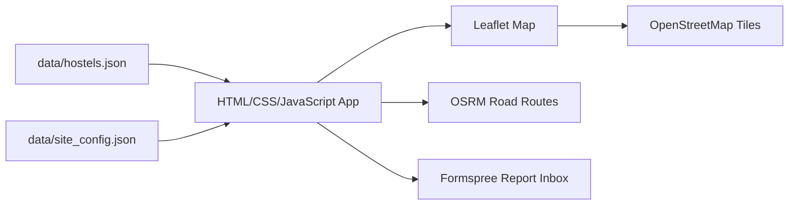

# Nookly: OAU Student Housing Finder

## Project Report

**Programme:** Student Work Experience Programme (SWEP 200)  
**Project Title:** Nookly: OAU Student Housing Finder  
**Project Type:** Functional web-based student housing discovery system  
**Institution Context:** Obafemi Awolowo University, Ile-Ife  
**Verification Date Shown In System:** 03/10/2026  
**Live Report Channel:** Formspree correction report form

## Abstract

Nookly is a web-based hostel discovery and comparison system developed for students around Obafemi Awolowo University, Ile-Ife. The project addresses the difficulty students face when comparing hostel names, locations, rent periods, room types, facilities, distance and availability from scattered information sources. The system provides a responsive web interface, verified hostel cards, search and filtering, map-based routing, budget planning, hostel comparison and a correction report form.

The project applies SWEP 200 concepts including Web Technology, Networking, Product Design, Data Analysis, Python-based data preparation and basic Cyber Security awareness. The final version contains 48 hostel records, including on-campus and off-campus options. On-campus hostels use the Hezekiah Oluwasanmi Library as a reference point, while off-campus hostels use OAU Main Gate. Reports are submitted through Formspree, and the map uses Leaflet, OpenStreetMap tiles and OSRM routing.

## 1. Introduction

Accommodation is a practical challenge for many university students. Around OAU, students often depend on word-of-mouth, social media posts, map searches and informal contacts to locate hostels. This makes comparison slow, inconsistent and sometimes confusing. Students may know a hostel name but not its approximate location, rent period, room type or route from campus.

Nookly was designed as a functional web-based solution for discovering and comparing student housing around OAU. It is not a booking platform. Instead, it helps students make a better first comparison before physically visiting or contacting a hostel.

## 2. Problem Statement

Students around OAU face these problems:

- Hostel information is scattered across conversations, websites, map listings and reviews.
- On-campus and off-campus accommodation details are not presented together.
- Rent periods are unclear; on-campus accommodation is per session, while off-campus rent is usually yearly.
- Distance and route context are difficult to compare quickly.
- Students need a way to report wrong or outdated information.
- Many existing solutions are only static pages and do not provide useful filtering, comparison or route context.

## 3. Aim And Objectives

The aim of this project is to build a functional web-based hostel finder that helps OAU students discover and compare accommodation options.

The objectives are:

1. Build a responsive website using HTML, CSS and JavaScript.
2. Store hostel information in structured JSON data.
3. Provide search, filter and sorting features for hostel discovery.
4. Show hostel locations and route context on an interactive map.
5. Separate on-campus and off-campus reference points.
6. Provide budget and comparison tools.
7. Allow users to submit correction reports.
8. Document the system clearly for defence and future maintenance.

## 4. Target Users

The main target users are:

- OAU students looking for accommodation.
- New students comparing on-campus and off-campus options.
- Returning students checking price, distance and room context.
- Project team members who need to update hostel records.
- Reviewers/lecturers evaluating the SWEP project.

## 5. Technologies Used

| Technology | Purpose |
|---|---|
| HTML | Page structure, forms, navigation, semantic content |
| CSS | Styling, layout, responsive design, mobile navigation |
| JavaScript | Search, filters, map logic, reports, comparison, budget calculations |
| Leaflet | Interactive map rendering |
| OpenStreetMap | Map tile data and attribution |
| OSRM | Road route calculation |
| Formspree | Online correction report delivery |
| JSON | Structured hostel data and site configuration |
| Python | Data preparation scripts and tests |
| Node.js | JavaScript syntax and app behavior tests |
| Pytest | Python validation tests |
| Git/GitHub | Version control and deployment source |
| Netlify | Planned static web hosting from GitHub |

These technologies were selected because they support a static, low-cost, easy-to-host web application with no paid map API key.

## 6. System Features

### 6.1 Hostel Directory

The system displays 48 hostel records. Every published hostel card shows a verified badge and a visible verification date. Cards include available details such as price range, room type, availability status, water information, facilities and rent period.

### 6.2 Search And Filters

Users can search by hostel name or area and filter by:

- Area
- Room type
- Location type
- Listing status
- Distance
- Water availability
- Saved hostels

### 6.3 Map And Route Display

The map uses Leaflet and OpenStreetMap. Road routes are requested through OSRM and cached in local browser storage for faster repeat usage. On-campus hostels route to Hezekiah Oluwasanmi Library, while off-campus hostels route to OAU Main Gate.

### 6.4 Budget Calculator

The planner allows users to estimate total cost by entering rent, additional fees, daily transport and number of travel days.

### 6.5 Hostel Comparison

Users can compare up to three selected hostels. The comparison table shows price, area, room, water, power, reference point, distance and status.

### 6.6 Report Form

Users can send correction reports directly to the project team through Formspree. The form asks for the hostel and the correction details. It also stores a local browser backup of submitted report data.

## 7. Data Design

Hostel records are stored in `data/hostels.json`. Each record may include:

- `id`
- `name`
- `campus_status`
- `area`
- `address_description`
- `latitude`
- `longitude`
- `price_min_ngn`
- `price_max_ngn`
- `room_type`
- `room_types`
- `water`
- `facilities`
- `listing_status`
- `last_verified_at`
- `verified_by`
- `rent_period`
- `distance_to_reference_km`

Site-level configuration is stored in `data/site_config.json`. It includes the main gate coordinate, the campus reference point and the Formspree report endpoint.

## 8. System Architecture

The application is a static frontend system. It loads JSON data from local files, renders hostel cards, creates map markers, requests OSRM road routes and submits correction reports to Formspree.



## 9. Implementation Highlights

### HTML

The project uses semantic page sections such as header, main, section, aside, forms and navigation. Form controls include labels and accessible status messages.

### CSS

The layout is responsive and mobile-first. The mobile experience uses bottom navigation for Home, Map, Hostels, Filters and Planner. Cards, panels and map sections adjust to smaller screens.

### JavaScript

JavaScript controls:

- Data loading
- Filtering and sorting
- Map marker rendering
- Route loading and caching
- Walk and drive estimates
- Local saved hostels
- Comparison table
- Budget calculator
- Report form submission
- HTML escaping and safe rendering

## 10. Security, Usability And Accessibility

Security awareness includes:

- Escaping dynamic text before inserting it into HTML.
- Restricting external links to safe HTTPS URLs.
- Avoiding secret API keys in the frontend.
- Using Formspree for report delivery instead of writing a custom insecure backend.
- Keeping unknown data hidden rather than inventing claims.

Usability and accessibility considerations include:

- Mobile-first navigation.
- Labels for form controls.
- Clear empty states.
- Status messages for filters, reports and routes.
- Responsive card layout.
- Map reset and route controls.

## 11. Testing

The system was tested using:

```powershell
node --check app.js
node tests/test_app.cjs
python -m pytest tests -q -p no:cacheprovider
```

The tests check JavaScript syntax, app behavior, data rendering, filtering, price matching, escaping, walking estimates, report-safe rendering and Python data-cleaning behavior.

Manual testing was also carried out in the browser using responsive inspection and live report submission through Formspree.

## 12. Challenges And Solutions

| Challenge | Solution |
|---|---|
| Google Maps API cost and billing concerns | Used Leaflet, OpenStreetMap and OSRM instead |
| Mobile users having to scroll too much | Redesigned architecture into Home, Map, Hostels, Filters and Planner views |
| Duplicate-looking addresses | Cleaned location display so cards show one professional location line |
| Unknown hostel details | Kept unknown values hidden or marked as unavailable instead of guessing |
| Report delivery | Connected the report form to Formspree |
| Route clutter on the map | Routes are controlled and selected routes are highlighted |
| Data freshness | Added visible verification date and report correction workflow |

## 13. Limitations

- The project is not a booking/payment platform.
- Availability can change after the verification date.
- Driving estimates do not include live traffic.
- OSRM routes depend on available OpenStreetMap road data.
- A verified listing does not guarantee vacancy or safety.

## 14. Future Improvements

Possible future improvements include:

- Admin dashboard for reviewing reports and editing hostel records.
- User accounts for project maintainers.
- Better photo gallery for verified hostels.
- More field survey updates.
- Analytics for most searched areas.
- Progressive Web App support for offline browsing.
- Optional backend with moderation and authentication.

## 15. Conclusion

Nookly is a functional web-based solution for student housing discovery around OAU. It applies HTML, CSS, JavaScript, mapping, routing, structured data, usability principles, basic security awareness and documentation practices. The system helps students search, filter, compare and report hostel details, making it more than a collection of static pages.

